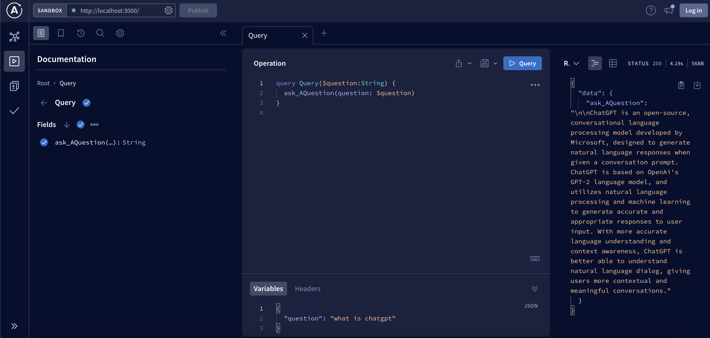

# Chat GPT Server

This backend server is built with,
1. NodeJS
2. Typescript
3. OpenAI 
4. GraphQL

## How to run

1. Replace your OpenAPI key in .env
2. Run https://localhost:3000
3. ask questions using Apollo sandbox and get answers from OpenAPI

## Example

